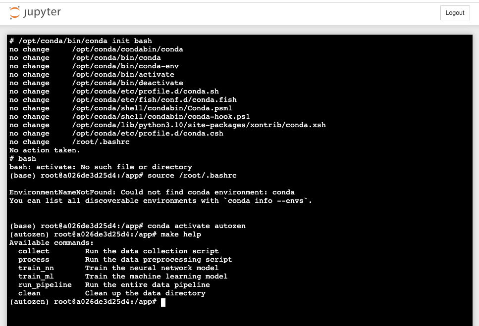

[](https://github.com/UBC-MDS/autozen/actions/workflows/ci.yml)
[](https://github.com/UBC-MDS/autozen/actions/workflows/docker-image.yml)
[](https://github.com/UBC-MDS/autozen/actions/workflows/test.yml)

# Autozen Valuation Guru


## Introduction 
[Autozen](https://www.autozen.com/) is a marketplace that connects private car sellers and dealerships in the used car market. As with any used car marketplace, one of the biggest challenges is accurately valuing the cars. Autozen uses the Canadian Black Book (CBB) to estimate the market value of used cars but has struggled with pricing inconsistencies. This can result in overpricing, which can deter potential buyers, or underpricing, which can cause the seller to lose out on potential profit. To address this issue, Autozen proposes the Autozen Valuation Guru project to leverage Data Science and Machine Learning methods to improve used car valuation. This project aims to help Autozen understand how used car features affect prices, assess the current CBB-based valuation method, and create a new valuation pipeline. By delivering a more accurate and reliable valuation, this project enables buyers and sellers to make informed decisions with greater confidence and positions Autozen as a leader in the used car market.

This project's primary objectives encompass three key areas:

1. The objective of this project is to evaluate the accuracy and efficacy of Autozen's current CBB-based valuation method and identify any inaccuracies and limitations.
2. Develop an auction price prediction model that incorporates the vehicle's inspection report. This model aims to increase the accuracy of valuations.
3. Seek to produce a more accurate prediction interval for auction prices, thereby reducing the uncertainty surrounding estimated values. 

This project directly addresses the needs of Autozen by delivering a final data product that provides more accurate and precise valuations after vehicle inspections and improves Autozen's auction process decision-making.

>This [README](README.md) file serves as the project's central information repository. You can navigate directly to a subsection of interest, or you can continue reading for more information. If you are interested in evaluating the data product, please jump to the Getting Started section below. 

## License
This repository and its contents are governed by a [commercial license](LICENSE). Please note that the commercial license applies to the work contained within this repository, including but not limited to the code, documentation, and any associated files. By accessing or using the contents of this repository, you agree to comply with the terms and conditions specified in the commercial license.The commercial license grants you certain rights and restrictions regarding the use, modification, and distribution of the work. It is important to carefully review the license to understand the permissions and limitations imposed. If you have any questions or require further clarification regarding the license or permitted usage, please reach out to the appropriate authorities or [contributors](#contributors) responsible for managing the licensing of this work.

## Table of Contents
* [Contributors](#contributors)
* [Overview of the Data Product](#overview-of-the-data-product)
* [Pre-requisites and Dependencies](#pre-requisites-and-dependencies)
* [Getting Started](#getting-started)
* [Resources](#resources)
* [Credits](#credits)

## Contributors
This github repository and all of its artefacts are deliverables of the MDS-591 capstone project for the [UBC MDS](https://masterdatascience.ubc.ca/) master's programme. They were provided by the following master's students from the seventh cohort of 2022-2023:

* [Dhruvi Nishar](https://github.com/dhruvinishar)
* [HanChen Wang](https://github.com/hcwang24)
* [Mengjun Chen](https://github.com/Mengjun74)
* [Tony Zoght](https://www.linkedin.com/in/tzoght/)

Mentored by:
* [Dr. Gittu George](https://masterdatascience.ubc.ca/why-ubc/people/faculty/gittu-george-postdoctoral-research-and-teaching-fellow-mds-vancouver)
  
## Overview of the Data Product
In a nutshell, Autozen Valuation Guru is a typical data product that takes training data collected from the Autozen SaaS (Software As A Service) production data and generates a trained model capable of making accurate predictions.

You can think of it as a data pipeline with multiple phases that leads to a trained model and a more accurate prediction of the used car's value based on CBB data, make/model/trim data, and inspection data collected by Autozen field inspectors.


### Data Collection
Since the Data is private, I delete the data folder.

### Data Preprocessing
During this step, the JSON columns are flattened and the pertinent attributes are extracted. In addition, the auctions, inspections, and vehicles tables are joined to create two distinct output csv files: There are two files: **processed_az_auctioned.csv**, which contains information about auctioned used cars, and **processed_az_auctioned_won.csv**, which represents the subset of auction-winning bids for used cars (i.e., cars that had willing buyers at the auction with an offer price).

* script: [scripts/data_collection.py](scripts/data_preprocessing.py)
* input: output from the previous phase [Data Collection](#data-collection)
* output:
  * [data/processed_az_auctioned.csv](data/processed_az_auctioned.csv)
  * [data/processed_az_auctioned_won.csv](data/processed_az_auctioned_won.csv)

### Data Imputation and Feature Transformation
In light of the fact that we had missing data, primarily regarding inspection attributes (see [EDA](EDA.ipynb)), the data imputation phase dealt with this absence. In this phase, the data types and feature transformation were also defined.
For efficiency and design best practises, this phase was created as the parent class for the subsequent phases of model training, and it provided the features preprocessor and data imputation functions.
* scripts:
  * [scripts/autozen_features.py](scripts/autozen_features.py)
  * [scripts/data_preprocessing.py](scripts/data_preprocessing.py)

### Models training and Evaluation
During this phase, we define and train the various prediction models. We have two groups of models, ML models and Deep Neural Network models, which are trained and evaluated in this phase.
* scripts:
  * [scripts/model_ml_training.py](scripts/model_ml_training.py)
  * [scripts/model_nn_training.py](scripts/model_nn_training.py)
* input: output from the previous phase [Data Collection](#data-collection)
* output: trained models with evaluation scores
  
### Best Model Optimization and Predictions
This phase fine-tunes the best model from [Models training and Evaluation](#models-training-and-evaluation) to produce the most accurate prediction possible. In addition, this phase reveals examples and functions that can be used to generate new predictions. 
* script: [scripts/model_ml_training.py](scripts/model_optimization.py)
* input: output from the previous phase [Data Collection](#models-training-and-evaluation)
* output: best model trained and prediction examples

## Pre-requisites and Dependencies
In our implementation of the data pipeline and associated code blocks in the Jupyter notebooks, we used **Python** 3.10 as the programming language. All requisite Python modules employed in this project are open-source and possess permissible licensing, enabling Autozen to utilize them in production without encountering any limitations. Notably, these modules **do not include** any licenses governed by the GPL (General Public License) which are restrictive.

Before trying the Autozen Valuation Guru data pipeline on your local development machine,  you must first install the following prerequisits
1. [Python 3.10+](https://www.python.org/downloads/)
2. [Conda 23.3+](https://conda.io/projects/conda/en/latest/user-guide/install/index.html)
3. [Make (GNU Make 3.81)](https://www.gnu.org/software/make/)

The remaining dependencies are managed by the [autozen](autozen.yml) Conda managed environment, which will be covered in the subsequent sections.
> When building and running the [Docker](https://www.docker.com/) container from this repository, all necessary dependencies are automatically installed.

 This repository follows the typical data science project directory structure:
```bash
├── Autozen.ipynb          # The main Jupyter notebook demonstrates the data pipeline
├── Dockerfile-arm         # Dockerfile for Arm-based systems (new Mac machines)
├── Dockerfile-intel       # Dockerfile for Intel-based Systems
├── EDA.ipynb              # Exploratory Data Analysis Jupyter notebook
├── LICENSE                # License file
├── Makefile               # Makefile to drive and run the data pipeline
├── README.md              # This file
├── autozen.yml            # Conda yml file which defines the project dependencies
├── data (directory)       # Data directory for raw and preprocessed data csv files
├── documents(directory)   # Contains documentation artefacts such as presentations and dashboards
├── img (directory)        # Contains static images used within this repository
├── models (directory)     # Contains saved tuned models
├── scripts (directory)    # Contains all Python scripts used in this project.
├── tests (directory)      # Contains unit tests
└── .github/workflows      # Contains CI/CD automated workflows and actions
```

## Getting Started 

Depending on your preferences, you have two options for getting started as a contributor or a user attempting to run the data pipeline after cloning this repository:

1. Follow **Local Development** directives If you prefer to develop and run scripts directly on your development machine, outside of a container.
2. Use **Docker Container** instructions If you prefer to contribute or execute scripts using Docker containers. Note that this step requires that you have already installed [Docker](https://www.docker.com/get-started/) on your target machine. 

> Before you get started to use the data pipeline, you must create the **autozen-credentials.json** file which contains the credentials to the DB where the data to collect resides. The file is of the following format and should be located at the root directory of the repository. 
>  ```python
> {
>     "host": "********.us-east-2.rds.amazonaws.com",
>     "port": 3306,
>     "user": "***",
>     "password": "******",
>     "database": "******"
> }
>  ```

### Local Development 
If you prefer to develop and run the scripts from the command line, outside of a container, and directly on your development machine, please follow the instructions below, assuming you have successfully installed all the [Pre-requistes and Dependencies](#pre-requistes-and-dependencies)  mentioned above:


1. From your local terminal and at the root directory of this local repository: 

    `conda env create -f autozen.yml`
    

2. Then activate the newly created environment:

    `conda activate autozen`
    

3. To list the targets that you can run with the data pipeline:

    `make help`
    
    This will print the available make targets
    ```bash 
    $ make help
    Available commands:
        collect        Run the data collection script
        process        Run the data preprocessing script
        train_nn       Train the neural network model
        train_ml       Train the machine learning model
        optimize       Optimize the best model
        run_pipeline   Run the entire data pipeline
        clean          Clean up the data directory
    ```
4. To run, for example, the full pipeline, you can use the following command:
    
    `make run_pipeline`


    or if you want to run a specific flow up to a specific phase, such as training the ml models:

    `make train_ml`

> **When using VS Code (IDE)**: To run the pipeline from VS Code, please follow the same instructions as above and add the root directory of this local repository to a new VS Code project. To run the included Jupyter notebooks, make sure to select the autozen Python Kernel before running the notebooks (as shown below):


### Docker Container

This repository contains Dockerfiles that can be used to build Docker images to be used to run the pipeline and explore the bundled Jupyter notebooks. 

1. Assuming you have Docker installed on your machine, you can build the image (using the corresponding processor-specific Dockerfile). For example, if you are using a Mac with M1 or M2 chips, you will need to use the **arm** version, otherwise **intel** will suffice:

    `docker build . -f Dockerfile-arm -t autozen/py-conda-jupyter`

2. Now that we have a Docker image called **autozen/py-conda-jupyter** in the local Docker registry, run the contnainer:    

    `docker run -p 8888:8888 -v $(pwd):/app autozen/py-conda-jupyter`

    This will start Jupyter notebook within the Doker container. At this point, copy and paste the provided uURLrl printed on the command line after you issue the `docker run` command above.

    ```bash
    To access the notebook, open this file in a browser:
        file:///root/.local/share/jupyter/runtime/nbserver-1-open.html
    Or copy and paste one of these URLs:
        http://19e6165e5899:8888/?token=dbada7956b2bf21608fe594e8b8735c247db1a3438ba6a12
    or http://127.0.0.1:8888/?token=dbada7956b2bf21608fe594e8b8735c247db1a3438ba6a12
    ``` 


    

    Open Autozen.ipynb notebook select the autozen kernel from the menu as shown below

    

    Now you can run the bundled Jupyter notebooks and the run the included scripts using this docker sandbox environment. 


To run the pipeline from the command line on the Docker container, follow the steps below:

1. From the running Jupyter notebook main page, launch a terminal (see below)
   

2. From the command line on the Jupyter terminal, setup the shell for Conda by typing the following commands in Juypter's terminal:
   `/opt/conda/bin/conda init bash`
   Then:
   `bash`
   Next:
   `source /root/.bashrc`
   Finally
   `conda activate autozen`

3. Now you can proceed to run the pipeline steps using make, as mentioned previously 

> When done, to shut down the Docker container, simply hit Ctrl+C from the command line where you were running the Docker container.


## Continuous Integration (CI)
This repository uses GitHub Actions as a continuous integration (CI) system to automate the installation of Python dependencies, running tests, and linting. This ensures that the codebase remains in a consistently deployable state. The CI workflow is defined in the `.github/workflows/ci.yml` file.

The CI workflow is triggered on every `push` or `pull_request` event to the `main` branch. Once triggered, the workflow performs the following operations:

1. The repository is checked out to the GitHub Actions runner using the `actions/checkout@v3` action.
2. Python 3.10 is set up on the runner with the `actions/setup-python@v3` action.
3. Conda is set up on the runner with the `conda-incubator/setup-miniconda@v2` action.
4. Python dependencies are installed by creating a new conda environment from the `autozen.yml` file.
5. The installed packages are listed for logging purposes using `conda list`.
6. The data pipeline is run by executing the `make run_pipeline` command.

The workflow uses secrets stored in the GitHub repository to securely provide the environment variables required for the data pipeline. These include the host, port, user, password, and database name for the Autozen database. These secrets are stored in the GitHub repository settings and are not exposed in logs or available to users with read access.

By leveraging GitHub Actions for CI, this repository ensures that every change to the `main` branch is deployable and that the data pipeline can be executed successfully. This reduces the risk of deploying broken code and helps to maintain high code quality.

[](https://github.com/UBC-MDS/autozen/actions/workflows/ci.yml)


## Resources
* [Autozen Jupyter notebook](Autozen.ipynb)
* [EDA Jupyter notebook](EDA.ipynb)
* [Project Proposal](documents/Project_proposal_revision.md)
* [Data Schema](documents/Appendix_A_DataSchema.md)
* [Technical Report](TECHREPORT.md)
