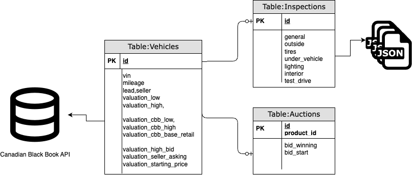

### Team Members:

-   Mengjun Chen
-   Dhruvi Nishar
-   HanChen Wang
-   Tony Zoght

### **Partner:**

Autozen Technology

### Mentor:

Dr. Gittu George

### Course:

DSCI 591 Capstone Project

Summer 2023

The University of British Columbia

## Data Source

Autozen granted us access to their production data spanning the period from 2021 to 2023. The data comprises three relational tables: vehicle inventory, inspections, and auction results. These tables contain a combination of structured columns with categorical, ordinal, numerical, and binary data types, as well as photos of the cars, CARFAX documents, text, and JSON objects. We excluded the photo, document, and text columns since they were already represented by the structured columns. 

The data collection script was designed to extract the desired information, flatten the JSON objects, and consolidate them into a master dataset consisting of 216 features (Appendix A). These features were categorized as follows:

-   General information: make, model, year, mileage, color, location, etc.

-   Outside: rust status, scratches, etc.

-   Tires: tread depth, condition of rims, etc.

-   Under-vehicle: exhaust state, differential, etc.

-   Under the hood: drive belt condition, battery health, engine oil status, etc.

-   Lighting: headlights and taillights' working conditions, etc.

-   Interior: seat condition, dashboard status, odors, etc.

-   Test drive evaluations: handling, braking system, external noise, etc.

-   Auction results: date, starting bid, valuation ranges by CBB and Autozen, winning bid, offer status, etc.

Notably, the winning bid serves as the target variable for the predictive models in this project. 

## Features

### Numerical

|           |                                           |                           |                                                    |
|-----------|-------------------------------------------|---------------------------|----------------------------------------------------|
| **Index** | **Column**                                | **Number of Null Values** | **Levels**                                         |
| 1         | bid_start                                 | 0                         | [98762.0, 46107.0, 118700.0, 116690.0, 116000....  |
| 2         | general_mileage                           | 0                         | [7697.0, 3500.0, 64000.0, 12481.0, 26000.0, 19\... |
| 3         | interior_numberOfKeysFobs                 | 1134                      | [nan, 2.0, 3.0, 1.0]                               |
| 4         | interior_numberOfKeysFobsDeclared         | 200                       | [2.0, 1.0, nan, 3.0, 4.0, 5.0]                     |
| 5         | interior_numberOfWorkingKeysFobs          | 8                         | [1.0, 2.0, 3.0, 0.0, 4.0, nan, 5.0]                |
| 6         | tires_driverFrontBreakPadMeasurement      | 355                       | [7.0, 8.0, 5.0, 6.0, nan, 10.0, 9.0, 0.0, 4.0,\... |
| 7         | tires_driverFrontPressure                 | 0                         | [32.0, 34.0, 50.0, 36.0, 31.0, 35.0, 37.0, 39....  |
| 8         | tires_driverFrontTreadDepth               | 325                       | [8.0, 6.0, 4.0, 9.0, 5.0, 10.0, nan, 14.0, 7.0\... |
| 9         | tires_driverRearBreakPadMeasurement       | 364                       | [6.0, 8.0, 5.0, 9.0, nan, 10.0, 7.0, 4.0, 2.0,\... |
| 10        | tires_driverRearPressure                  | 0                         | [32.0, 34.0, 50.0, 35.0, 30.0, 37.0, 38.0, 36....  |
| 11        | tires_driverRearTreadDepth                | 328                       | [7.0, 4.0, 9.0, 5.0, nan, 14.0, 13.0, 11.0, 0....  |
| 12        | tires_passengerFrontBreakPadMeasurement   | 362                       | [7.0, 5.0, 6.0, nan, 8.0, 10.0, 4.0, 9.0, 3.0,\... |
| 13        | tires_passengerFrontPressure              | 0                         | [32.0, 34.0, 50.0, 36.0, 29.0, 30.0, 35.0, 37....  |
| 14        | tires_passengerFrontTreadDepth            | 328                       | [9.0, 7.0, 4.0, 8.0, 5.0, 10.0, nan, 14.0, 0.0\... |
| 15        | tires_passengerRearBreakPadMeasurement    | 362                       | [6.0, 7.0, 9.0, nan, 5.0, 10.0, 4.0, 8.0, 3.0,\... |
| 16        | tires_passengerRearPressure               | 0                         | [32.0, 34.0, 50.0, 35.0, 30.0, 37.0, 36.0, 38....  |
| 17        | tires_passengerRearTreadDepth             | 328                       | [7.0, 4.0, 9.0, 5.0, nan, 14.0, 13.0, 11.0, 0....  |
| 18        | under_the_hood_batteryActualMeasurement   | 1258                      | [nan, 742.0, 462.0, 690.0, 248.0, 435.0, 320.0\... |
| 19        | under_the_hood_batteryRating              | 1258                      | [nan, 810.0, 600.0, 725.0, 840.0, 525.0, 500.0\... |
| 20        | under_the_hood_coolantStrengthMeasurement | 804                       | [nan, -42.0, -40.0, -50.0, -30.0, -51.0, -49.0\... |
| 21        | valuation_autozen_high                    | 0                         | [107531.0, 48738.0, 125588.0, 127061.0, 142950\... |
| 22        | valuation_autozen_low                     | 0                         | [98762.0, 44764.0, 115247.0, 116690.0, 131256....  |
| 23        | valuation_cbb_trade_in_high               | 24                        | [99566.0, 47318.0, 121930.0, 117649.0, 138786....  |
| 24        | valuation_cbb_trade_in_low                | 17                        | [91446.0, 43460.0, 111890.0, 108046.0, 127433....  |
| 25        | valuation_highest_bid_amount              | 86                        | [128500.0, 123333.0, 118700.0, 116690.0, 11600\... |
| 26        | valuation_seller_asking_price             | 549                       | [nan, 0.0, 1.0, 78000.0, 73000.0, 72000.0, 980\... |
| 27        | valuation_starting_price                  | 0                         | [98762.0, 46107.0, 118700.0, 116690.0, 116000....  |

### Ordinal

|           |                                             |                           |                                                    |
|-----------|---------------------------------------------|---------------------------|----------------------------------------------------|
| **Index** | **Column**                                  | **Number of Null Values** | **Levels**                                         |
| 1         | general_additionalWarranty                  | 221                       | [yes, no, unknown, nan]                            |
| 2         | general_transferableWarranty                | 221                       | [unknown, yes, no, nan]                            |
| 3         | interior_acOperationBlowsCold               | 1232                      | [nan, ok, serviceRequired]                         |
| 4         | interior_additionalIssuesInterior           | 968                       | [nan, ok, serviceSuggested, serviceRequired]       |
| 5         | interior_audioSteeringWheelControls         | 28                        | [ok, nan, notAvailable, serviceSuggested, serv\... |
| 6         | interior_audioSystem                        | 28                        | [ok, nan, serviceSuggested, serviceRequired]       |
| 7         | interior_carpetFloorMats                    | 34                        | [ok, nan, serviceSuggested, serviceRequired]       |
| 8         | interior_centerConsole                      | 99                        | [ok, serviceRequired, nan, serviceSuggested]       |
| 9         | interior_cigaretteLighterPowerOutlets       | 902                       | [nan, ok, serviceSuggested, notAvailable]          |
| 10        | interior_conditionOfSeats                   | 205                       | [ok, serviceSuggested, serviceRequired, nan]       |
| 11        | interior_dashboard                          | 40                        | [ok, nan, serviceSuggested, serviceRequired]       |
| 12        | interior_doorHandles                        | 34                        | [ok, serviceSuggested, nan, serviceRequired]       |
| 13        | interior_driverFrontDoorTrim                | 41                        | [ok, serviceSuggested, serviceRequired, nan]       |
| 14        | interior_driverFrontSeatHeater              | 40                        | [ok, notAvailable, nan]                            |
| 15        | interior_driverRearDoorTrim                 | 49                        | [ok, serviceSuggested, nan, notAvailable, serv\... |
| 16        | interior_driverRearSeatHeater               | 40                        | [notAvailable, ok, nan, serviceRequired]           |
| 17        | interior_evChargingKit                      | 1323                      | [nan, notAvailable]                                |
| 18        | interior_fuelDoorRelease                    | 34                        | [ok, serviceRequired, nan, serviceSuggested]       |
| 19        | interior_gloveBox                           | 895                       | [nan, ok, serviceSuggested]                        |
| 20        | interior_gloveBoxCenterConsole              | 1259                      | [nan, ok, serviceSuggested]                        |
| 21        | interior_headliner                          | 39                        | [ok, nan, serviceSuggested]                        |
| 22        | interior_headrests                          | 40                        | [ok, nan, serviceSuggested, serviceRequired]       |
| 23        | interior_hoodRelease                        | 34                        | [ok, nan, serviceRequired, serviceSuggested]       |
| 24        | interior_horn                               | 42                        | [ok, nan, serviceRequired]                         |
| 25        | interior_keyFobCondition                    | 34                        | [ok, serviceRequired, nan, serviceSuggested]       |
| 26        | interior_navigationOperation                | 28                        | [ok, notAvailable, serviceSuggested, nan, serv\... |
| 27        | interior_passengerFrontDoorTrim             | 41                        | [ok, serviceSuggested, nan, serviceRequired]       |
| 28        | interior_passengerFrontSeatHeater           | 40                        | [ok, notAvailable, nan, serviceSuggested, serv\... |
| 29        | interior_passengerRearDoorTrim              | 63                        | [ok, serviceSuggested, nan, notAvailable, serv\... |
| 30        | interior_passengerRearSeatHeater            | 40                        | [notAvailable, ok, nan, serviceSuggested]          |
| 31        | interior_powerSeatOperation                 | 40                        | [ok, notAvailable, nan, serviceSuggested, serv\... |
| 32        | interior_rearCamera                         | 36                        | [ok, nan, notAvailable, serviceRequired, servi\... |
| 33        | interior_rearViewMirror                     | 40                        | [ok, nan, serviceRequired, serviceSuggested]       |
| 34        | interior_rearWindowDefrostOperation         | 36                        | [ok, nan, notAvailable, serviceSuggested, serv\... |
| 35        | interior_seatBelts                          | 40                        | [ok, nan, serviceRequired, serviceSuggested]       |
| 36        | interior_seats                              | 1159                      | [nan, ok, serviceSuggested]                        |
| 37        | interior_spareTire                          | 34                        | [yes, no, notAvailable, ok, nan]                   |
| 38        | interior_spareTireTools                     | 34                        | [yes, no, notAvailable, ok, nan, serviceSugges\... |
| 39        | interior_steeringWheel                      | 115                       | [ok, nan, serviceRequired, serviceSuggested]       |
| 40        | interior_steeringWheelSteeringColumn        | 1253                      | [nan, ok, serviceSuggested]                        |
| 41        | interior_sunroofOperation                   | 40                        | [ok, notAvailable, nan, serviceSuggested, serv\... |
| 42        | interior_sunVisors                          | 40                        | [ok, nan, serviceSuggested]                        |
| 43        | interior_trunkRelease                       | 35                        | [ok, notAvailable, serviceRequired, nan, servi\... |
| 44        | interior_waterLeaks                         | 39                        | [ok, nan, serviceSuggested, serviceRequired]       |
| 45        | lighting_additionalIssuesLighting           | 939                       | [nan, ok, serviceSuggested, serviceRequired]       |
| 46        | lighting_brakeLights                        | 5                         | [ok, nan, serviceSuggested, serviceRequired]       |
| 47        | lighting_emergency4WayFlashers              | 4                         | [ok, serviceSuggested, nan]                        |
| 48        | lighting_fogLights                          | 4                         | [ok, notAvailable, serviceSuggested, nan, serv\... |
| 49        | lighting_frontDRL                           | 4                         | [ok, notAvailable, serviceSuggested, nan]          |
| 50        | lighting_frontSignalLights                  | 5                         | [ok, serviceSuggested, nan, serviceRequired]       |
| 51        | lighting_headlightsHighBeam                 | 4                         | [ok, serviceSuggested, nan]                        |
| 52        | lighting_headlightsLowBeam                  | 4                         | [ok, serviceSuggested, nan, serviceRequired]       |
| 53        | lighting_interiorLights                     | 4                         | [ok, nan, serviceSuggested]                        |
| 54        | lighting_licensePlateLight                  | 5                         | [ok, nan, serviceRequired, serviceSuggested]       |
| 55        | lighting_rearSignalLights                   | 4                         | [ok, nan, serviceSuggested]                        |
| 56        | lighting_reverseLights                      | 4                         | [ok, nan, serviceSuggested]                        |
| 57        | lighting_sideMarkerLights                   | 4                         | [ok, notAvailable, serviceRequired, nan, servi\... |
| 58        | lighting_tailLights                         | 5                         | [ok, serviceSuggested, serviceRequired, nan]       |
| 59        | outside_additionalIssuesExterior            | 925                       | [nan, ok, serviceSuggested, serviceRequired]       |
| 60        | outside_bodyDentsDingsHailDamage            | 12                        | [serviceSuggested, ok, serviceRequired, nan]       |
| 61        | outside_collisionDamage                     | 14                        | [ok, serviceSuggested, serviceRequired, nan]       |
| 62        | outside_driverFrontWindowGlass              | 909                       | [nan, ok]                                          |
| 63        | outside_driverFrontWindowGlassOperation     | 17                        | [ok, nan, serviceSuggested]                        |
| 64        | outside_driverPowerSlidingDoors             | 17                        | [notAvailable, ok, nan, serviceRequired, servi\... |
| 65        | outside_driverRearWindowGlass               | 909                       | [nan, ok, serviceRequired]                         |
| 66        | outside_driverRearWindowGlassOperation      | 17                        | [ok, notAvailable, nan, serviceRequired]           |
| 67        | outside_driverSideMirror                    | 17                        | [serviceSuggested, ok, nan, serviceRequired]       |
| 68        | outside_driverSideMirrorHeater              | 909                       | [nan, ok, notAvailable]                            |
| 69        | outside_liftgateOperation                   | 13                        | [ok, notAvailable, nan, serviceRequired, servi\... |
| 70        | outside_paintFinish                         | 13                        | [ok, serviceSuggested, serviceRequired, nan]       |
| 71        | outside_paintScratches                      | 12                        | [serviceSuggested, ok, serviceRequired, nan]       |
| 72        | outside_passengerFrontWindowGlass           | 909                       | [nan, ok, serviceSuggested]                        |
| 73        | outside_passengerFrontWindowGlassOperation  | 17                        | [ok, nan, serviceSuggested, serviceRequired]       |
| 74        | outside_passengerPowerSlidingDoors          | 17                        | [notAvailable, ok, nan]                            |
| 75        | outside_passengerRearWindowGlass            | 909                       | [nan, ok, serviceSuggested]                        |
| 76        | outside_passengerRearWindowGlassOperation   | 18                        | [ok, notAvailable, nan, serviceRequired]           |
| 77        | outside_passengerSideMirror                 | 17                        | [ok, serviceSuggested, serviceRequired, nan]       |
| 78        | outside_passengerSideMirrorHeater           | 909                       | [nan, ok, notAvailable]                            |
| 79        | outside_rustCorrosion                       | 11                        | [ok, serviceSuggested, serviceRequired, nan]       |
| 80        | outside_washerSprayNozzels                  | 910                       | [nan, ok, serviceSuggested, serviceRequired]       |
| 81        | outside_WindshieldGlass                     | 15                        | [serviceSuggested, ok, serviceRequired, nan]       |
| 82        | outside_wiperBlades                         | 909                       | [nan, ok, serviceRequired, serviceSuggested]       |
| 83        | test_drive_abnormalWindNoise                | 9                         | [ok, notAvailable, serviceSuggested, nan, serv\... |
| 84        | test_drive_acOperationBlowsCold             | 159                       | [ok, nan, notAvailable, serviceSuggested, serv\... |
| 85        | test_drive_additionalIssuesTestDrive        | 857                       | [nan, ok, serviceSuggested, serviceRequired]       |
| 86        | test_drive_alignment                        | 8                         | [ok, pullsRight, Ok, notAvailable, nan, pullsL\... |
| 87        | test_drive_alignmentCheck                   | 8                         | [ok, serviceSuggested, notAvailable, nan, serv\... |
| 88        | test_drive_automaticManualTransmissionShift | 8                         | [ok, notAvailable, nan, serviceSuggested, serv\... |
| 89        | test_drive_brakingSystem                    | 8                         | [ok, nan, notAvailable, serviceSuggested, serv\... |
| 90        | test_drive_cabinHeatBlowsHot                | 78                        | [ok, nan, serviceSuggested, serviceRequired]       |
| 91        | test_drive_clutchOperationEngagement        | 9                         | [ok, notAvailable, nan, serviceRequired, servi\... |
| 92        | test_drive_cruiseControl                    | 8                         | [ok, notAvailable, nan, serviceSuggested, serv\... |
| 93        | test_drive_engine3000RPM                    | 8                         | [ok, notAvailable, nan, serviceSuggested, serv\... |
| 94        | test_drive_engineRPMIdle                    | 9                         | [ok, notAvailable, nan, serviceSuggested, serv\... |
| 95        | test_drive_parkingBreak                     | 8                         | [ok, nan, serviceSuggested, serviceRequired]       |
| 96        | test_drive_steeringWheelStraight            | 8                         | [ok, notAvailable, nan, serviceSuggested, serv\... |
| 97        | test_drive_testDriveStatus                  | 741                       | [nan, ok, serviceRequired, serviceSuggested]       |
| 98        | test_drive_vibrationWhileBraking            | 8                         | [ok, notAvailable, nan, serviceSuggested, serv\... |
| 99        | test_drive_vibrationWhileDriving            | 9                         | [ok, notAvailable, nan, serviceSuggested, serv\... |
| 100       | tires_additionalIssuesTires                 | 1150                      | [nan, ok, serviceSuggested, serviceRequired]       |
| 101       | tires_driverFrontBrakePad                   | 317                       | [ok, notAvailable, nan, serviceSuggested, serv\... |
| 102       | tires_driverFrontCondition                  | 316                       | [ok, serviceSuggested, nan, serviceRequired]       |
| 103       | tires_driverFrontCV                         | 318                       | [notAvailable, ok, nan, serviceSuggested]          |
| 104       | tires_driverFrontRotorCondition             | 319                       | [ok, serviceSuggested, nan, notAvailable]          |
| 105       | tires_driverFrontShockStrut                 | 318                       | [ok, nan, serviceSuggested]                        |
| 106       | tires_driverFrontSideSwayBar                | 318                       | [notAvailable, ok, nan, serviceSuggested, serv\... |
| 107       | tires_driverFrontTireCondition              | 478                       | [ok, serviceSuggested, nan, serviceRequired]       |
| 108       | tires_driverFrontValveStemCondition         | 899                       | [nan, ok, serviceRequired, serviceSuggested]       |
| 109       | tires_driverRearBrakePad                    | 318                       | [ok, notAvailable, nan, serviceSuggested, serv\... |
| 110       | tires_driverRearCondition                   | 318                       | [ok, serviceSuggested, nan, serviceRequired]       |
| 111       | tires_driverRearCV                          | 319                       | [notAvailable, ok, nan, serviceSuggested]          |
| 112       | tires_driverRearRotorCondition              | 319                       | [ok, nan, serviceSuggested, notAvailable, serv\... |
| 113       | tires_driverRearShockStrut                  | 319                       | [ok, nan, serviceSuggested]                        |
| 114       | tires_driverRearSideSwayBar                 | 319                       | [notAvailable, ok, nan, serviceSuggested, serv\... |
| 115       | tires_driverRearTireCondition               | 478                       | [ok, serviceSuggested, nan, serviceRequired]       |
| 116       | tires_driverRearValveStemCondition          | 900                       | [nan, ok, serviceRequired, serviceSuggested]       |
| 117       | tires_passengerFrontBrakePad                | 318                       | [ok, notAvailable, nan, serviceSuggested, serv\... |
| 118       | tires_passengerFrontCondition               | 319                       | [serviceSuggested, ok, serviceRequired, nan]       |
| 119       | tires_passengerFrontCV                      | 320                       | [notAvailable, ok, nan, serviceRequired, servi\... |
| 120       | tires_passengerFrontRotorCondition          | 319                       | [ok, nan, serviceSuggested, notAvailable, serv\... |
| 121       | tires_passengerFrontShockStrut              | 320                       | [ok, nan, serviceSuggested]                        |
| 122       | tires_passengerFrontSideSwayBar             | 321                       | [notAvailable, ok, nan, serviceSuggested]          |
| 123       | tires_passengerFrontTireCondition           | 479                       | [ok, serviceSuggested, nan, serviceRequired]       |
| 124       | tires_passengerFrontValveStemCondition      | 899                       | [nan, ok, serviceRequired, serviceSuggested]       |
| 125       | tires_passengerRearBrakePad                 | 318                       | [ok, notAvailable, nan, serviceSuggested, serv\... |
| 126       | tires_passengerRearCondition                | 318                       | [serviceSuggested, ok, nan, serviceRequired]       |
| 127       | tires_passengerRearCV                       | 319                       | [notAvailable, ok, nan, serviceSuggested]          |
| 128       | tires_passengerRearRotorCondition           | 321                       | [ok, nan, serviceSuggested, notAvailable, serv\... |
| 129       | tires_passengerRearShockStrut               | 320                       | [ok, nan, serviceSuggested]                        |
| 130       | tires_passengerRearSideSwayBar              | 320                       | [notAvailable, ok, nan, serviceSuggested]          |
| 131       | tires_passengerRearTireCondition            | 479                       | [ok, serviceSuggested, nan, serviceRequired]       |
| 132       | tires_passengerRearValveStemCondition       | 899                       | [nan, ok, serviceRequired, serviceSuggested]       |
| 133       | under_the_hood_acCompressorOperation        | 912                       | [nan, ok, notAvailable, serviceSuggested, serv\... |
| 134       | under_the_hood_acSystemLeaks                | 912                       | [nan, ok, notAvailable, serviceSuggested, serv\... |
| 135       | under_the_hood_additionalIssuesUnderHood    | 944                       | [nan, ok, serviceSuggested]                        |
| 136       | under_the_hood_alternator                   | 115                       | [ok, nan, notAvailable, serviceSuggested]          |
| 137       | under_the_hood_batteryStrength              | 118                       | [serviceRequired, ok, notAvailable, serviceSug\... |
| 138       | under_the_hood_brakeFluid                   | 126                       | [ok, nan, notAvailable, serviceSuggested, serv\... |
| 139       | under_the_hood_brakeMasterCylinder          | 912                       | [nan, ok, notAvailable, serviceSuggested]          |
| 140       | under_the_hood_coolantOverflowTank          | 125                       | [ok, nan, serviceSuggested, serviceRequired]       |
| 141       | under_the_hood_coolantStrength              | 912                       | [nan, ok, serviceSuggested, serviceRequired]       |
| 142       | under_the_hood_coolingFanOperation          | 126                       | [ok, nan, serviceRequired]                         |
| 143       | under_the_hood_driveBelts                   | 125                       | [ok, nan, notAvailable, serviceSuggested]          |
| 144       | under_the_hood_engineOilCondition           | 123                       | [ok, nan, notAvailable, serviceSuggested, serv\... |
| 145       | under_the_hood_engineOilLevel               | 116                       | [ok, nan, serviceSuggested, notAvailable, serv\... |
| 146       | under_the_hood_fuelSystemOperation          | 912                       | [nan, ok, notAvailable]                            |
| 147       | under_the_hood_powerSteeringFluid           | 125                       | [ok, notAvailable, nan, serviceSuggested]          |
| 148       | under_the_hood_radiatorHosesClamps          | 125                       | [ok, nan, serviceSuggested, serviceRequired]       |
| 149       | under_the_hood_starter                      | 125                       | [ok, nan, notAvailable]                            |
| 150       | under_the_hood_transmissionFluid            | 912                       | [nan, notAvailable, ok, serviceSuggested]          |
| 151       | under_the_hood_visibleOilLeaks              | 614                       | [ok, nan, notAvailable, serviceSuggested, serv\... |
| 152       | under_the_hood_waterPumpNoiseLeaks          | 912                       | [nan, ok, notAvailable]                            |
| 153       | under_vehicle_additionalIssuesUnderVehicle  | 917                       | [nan, ok, serviceSuggested]                        |
| 154       | under_vehicle_frontDifferential             | 1                         | [notAvailable, ok, serviceSuggested, serviceRe\... |
| 155       | under_vehicle_frontDriveShaft               | 919                       | [nan, notAvailable, ok, serviceSuggested]          |
| 156       | under_vehicle_mufflerExhaustTips            | 3                         | [ok, notAvailable, serviceSuggested, serviceRe\... |
| 157       | under_vehicle_rearDifferential              | 3                         | [ok, notAvailable, serviceSuggested, serviceRe\... |
| 158       | under_vehicle_rearDriveShaft                | 919                       | [nan, notAvailable, ok]                            |
| 159       | under_vehicle_transferCase                  | 3                         | [notAvailable, ok, serviceSuggested, nan]          |

### Categorical

|           |                          |                           |                                                    |
|-----------|--------------------------|---------------------------|----------------------------------------------------|
| **Index** | **Column**               | **Number of Null Values** | **Levels**                                         |
| 1         | general_fuelType         | 3                         | [gasoline, electric, hybrid, diesel, nan]          |
| 2         | general_make             | 0                         | [Porsche, Land Rover, Audi, Cadillac, Mercedes\... |
| 3         | general_model            | 0                         | [Panamera, Discovery Sport, 911, R8, Escalade,\... |
| 4         | general_roofType         | 3                         | [hardTop, softTopConvertible, hardTopConvertib\... |
| 5         | general_transmission     | 105                       | [automatic, manual, nan]                           |
| 6         | general_trim             | 2                         | [4 4D Sedan, P250 S 4D Utility, Carrera 4S 2D \... |
| 7         | general_warrantyProvider | 1094                      | [nan, Audi, BMW, , Tesla, GM, Land Rover, JL\...   |
| 8         | general_year             | 0                         | [2021.0, 2020.0, 2018.0, 2014.0, 2017.0, 2022....  |
| 9         | interior_odors           | 928                       | [nan, No, food, air freshener , no, smoke, Col\... |
| 10        | interior_seatsMaterial   | 537                       | [leather, nan, cloth]                              |
| 11        | vehicle_lead_source      | 0                         | [DDC, MQL, FAMILY, AUTOZEN]                        |

### Binary

| Index | **Column**                           | **Number of Null Values** | **Levels**     |
|-------|--------------------------------------|---------------------------|----------------|
| 1     | general_dashWarningLights            | 221                       | [no, yes, nan] |
| 2     | interior_carSmokedIn                 | 202                       | [no, nan, yes] |
| 3     | interior_navigationEquipped          | 451                       | [yes, no, nan] |
| 4     | interior_rearCameraEquipped          | 459                       | [yes, nan, no] |
| 5     | interior_sunroofEquipped             | 463                       | [yes, no, nan] |
| 6     | test_drive_testDriveCompleted        | 742                       | [yes, nan, no] |
| 7     | tires_aftermarketWheelsTires         | 1233                      | [nan, no, yes] |
| 8     | tires_extraSetOfWheelsTiresAvailable | 479                       | [no, yes, nan] |
| 9     | tires_oemAvailable                   | 1231                      | [nan, yes, no] |
| 10    | tires_oemFactoryWheelsAvailable      | 479                       | [yes, no, nan] |
| 11    | tires_secondSetOfTirePartOfDeal      | 745                       | [no, nan, yes] |

### Features to Drop

| Index | **Column**                                | **Number of Null Values** | **Levels**                                         |
|-------|-------------------------------------------|---------------------------|----------------------------------------------------|
| 1     | general_vinNumber                         | 0                         | [WP0AJ2A7XML112205, 1C3BCBFG4DN534082, WP0AB2A\... |
| 2     | id                                        | 0                         | [20WcRvcCQGcK0Xf87xCKftZgRzU, 26OiyX6eaafIwuwo\... |
| 3     | id_x                                      | 0                         | [20WRkuq4E3coq8yxkiee0J1CtEV, 26OiyK87l6U4HKMG\... |
| 4     | id_y                                      | 0                         | [20WRgbecgCUroEiUjdfUG5lF5kd, 26Oilnuea9KtA6RM\... |
| 5     | interior_dashboardDriverSide              | 1325                      | [nan]                                              |
| 6     | interior_dashboardPassengerSide           | 1325                      | [nan]                                              |
| 7     | num_auctions                              | 0                         | [1, 3, 2, 4, 6, 12, 7, 5, 11, 26]                  |
| 8     | product_id                                | 0                         | [20WRgbecgCUroEiUjdfUG5lF5kd, 26Oilnuea9KtA6RM\... |
| 9     | seller_type                               | 0                         | [consumer]                                         |
| 10    | test_drive_brakingSystemIncludingABS      | 1325                      | [nan]                                              |
| 11    | tires_aftermarketWheelsTiresHeader        | 1325                      | [nan]                                              |
| 12    | tires_confirmCustomerSecondWheelSet       | 1325                      | [nan]                                              |
| 13    | tires_extraSetOfWheelsTires               | 1325                      | [nan]                                              |
| 14    | tires_passengervPressure                  | 1325                      | [nan]                                              |
| 15    | under_the_hood_batteryStrengthMeasurement | 1325                      | [nan]                                              |
| 16    | valuation_cbb_base_retail_avg             | 1325                      | [nan]                                              |
| 17    | vehicle_mileage                           | 0                         | [7697.0, 3500.0, 64971.0, 12481.0, 26000.0, 19\... |
| 18    | vehicle_vin                               | 0                         | [WP0AJ2A7XML112205, 1C3BCBFG4DN534082, WP0AB2A\... |
