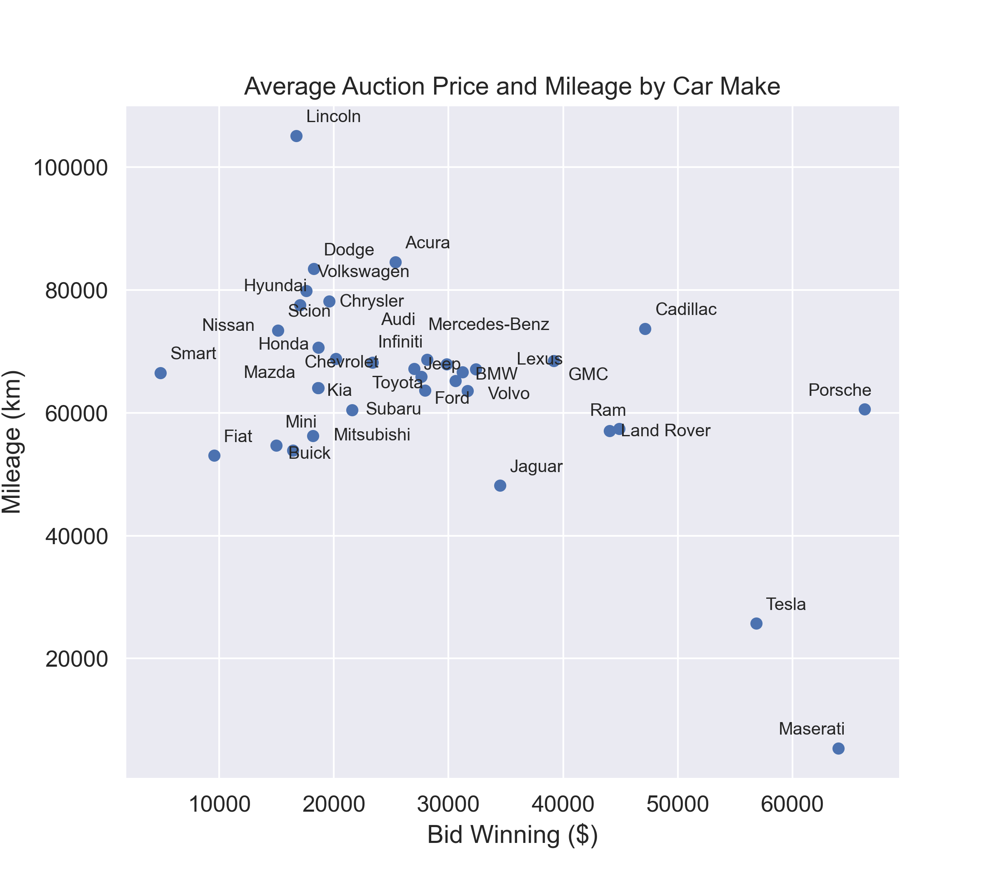

::: {align="center"}
### Team Members:

-   Mengjun Chen
-   Dhruvi Nishar
-   HanChen Wang
-   Tony Zoght

### **Partner:**

Autozen Technology

### Mentor:

Dr. Gittu George

### Course:

DSCI 591 Capstone Project

Summer 2023

The University of British Columbia

### Word count:

2462
:::

\newpage

## Executive Summary

Autozen, a managed marketplace for used car transactions, aims to enhance the accuracy of valuations through the Autozen Valuation Guru project.
This project leverages Data Science techniques to develop an accurate and precise predictive model that incorporates detailed car inspection reports.
By addressing these objectives, Autozen aims to enhance decision-making during auctions and provide more accurate valuations.
Through comprehensive data analysis, model training, and evaluation, the proposed model outperformed Autozen's existing valuation method.
The model's performance was further optimized and incorporated quantile regression to generate prediction intervals.
This data product will assist Autozen in estimating auction prices and providing a measure of uncertainty to aid decision-making.

## Introduction

Autozen, a managed marketplace facilitating transactions between private car sellers and car dealers, has transformed the process of selling used cars into a seamless and efficient experience.
By assuming responsibility for the entire process, from the initial inspection to the auction and final vehicle pickup and delivery, Autozen eliminates the burden on both sellers and dealers.
Since its public launch in the summer of 2021, Autozen has achieved remarkable success, with transactions exceeding \$30 million within its inaugural year.
Presently, Autozen operates in prominent Canadian cities including Vancouver, Toronto, Calgary, and Edmonton, and is expanding to Seattle.

Recognizing the significance of accurate valuations, Autozen utilizes the Canadian Black Book (CBB) as its valuation method.
However, Autozen acknowledges the limitations of this approach, as factors like mileage, condition, and damages can significantly impact used car auction prices.
To address this, Autozen introduces The Autozen Valuation Guru project, which leverages advanced Data Science techniques to gain deeper insights into the influence of various car features on auction prices.
The project aims to develop a novel predictive model that incorporates inspection reports, improving the accuracy and reliability of valuations.
Additionally, it seeks to generate more precise prediction intervals to reduce uncertainty surrounding estimated values.
By addressing these objectives, Autozen aims to enhance decision-making during the auction process and provide more accurate valuations after comprehensive car inspections.

## Data Science Methods

To ensure reproducibility, scripts for all sections below are integrated into an automated pipeline, forming part of the final product.
Refer to the accompanying technical report for detailed script descriptions (<https://github.com/UBC-MDS/autozen/blob/main/Autozen.ipynb>).

### Production Data Overview and Data Collection

Autozen provided us with production data from 2021 to 2023, comprising three relational tables: vehicle inventory, inspections, and auction results.
These tables contain structured columns with categorical, ordinal, numerical, and binary data types, along with JSON objects, photos, CARFAX documents, and texts.
To ensure data integrity and reduce redundancy, we flattened the JSON objects and excluded the other unstructured columns that were already represented.

Our data collection script extracted and consolidated the desired information into a master dataset with 216 features (Appendix A, <https://github.com/UBC-MDS/autozen/blob/main/documents/Appendix_A_DataSchema.pdf>).
Features were categorized into general information, exterior/interior conditions, tires, under-vehicle/hood details, lighting, test drive evaluations, and auction results.
The winning bid in the auction results category served as the target variable for predictive models.

### Exploratory Data Analysis (EDA)

The characteristics of the used cars were analyzed to gain insights and uncover patterns within the dataset (<https://github.com/UBC-MDS/autozen/blob/main/EDA.ipynb>). 

-   Summary statistics: bar plots, pie charts, line plots, and summary tables.

-   Numerical features: histograms, pair plots, and box plots.

-   Categorical and binary features: bar plots and pie charts.

-   Ordinal features: ordered bar plots.

-   The valuation method performance: a histogram of price differences and a line plot of quarterly mean absolute percentage error (MAPE).

### Tableau

A user-friendly Tableau dashboard was created for Autozen's executive team to explore car feature-auction price relationships.
Tableau's pre-built visualizations and drag-and-drop functionality made data exploration easy.
Its robust security measures protected sensitive data, making it a suitable choice for EDA compared to alternatives like Dash or Shiny.
Access to the dashboard is available upon request.

### Data Preprocessing

To ensure the data was suitable for modeling, preprocessing using the scikit-learn package was performed [@scikit-learn].
This included feature transformation, handling missing values through imputation, and feature selection.

#### Feature Transformation

-   Categorical features (car make, model, trim, fuel type, etc.) were OneHotEncoded for accurate representation.

-   Ordinal features (inspection assessments) were OrdinalEncoded with assigned numerical values for each level.

-   Numerical features (car age, mileage, etc.) were standardized and scaled using StandardScaler.

-   Binary features (warranty, extra tire availability) were OneHotEncoded with the binary option.

-   Irrelevant features (indexes, personally identifiable information) were dropped.

#### Data Missingness and Imputation

Missing data was investigated as it can impact the model performance.
Visual inspection, missing data matrix, and bar plot were used to identify the distribution and extent of missing values [@missingno].
The missing data showed a missing not-at-random pattern, suggesting a relationship between missingness and the data collection process.
To handle this, K-nearest neighbors (KNN) and iterative imputers were used for imputation [@scikit-learn].

#### Feature Selection

Lasso regularization was applied to the model for feature selection.
Lasso regularization prevents overfitting and improves interpretability by encouraging sparse coefficient estimates.
Alternatives such as ElasticNet regularization, which combines lasso and ridge regularization, were not implemented due to satisfactory performance with lasso regularization and the associated complexity and computational requirements for hyperparameter tuning.

### **Model Training and Evaluation Metric**

To develop a more accurate predictive model for auction prices of used cars, various regression machine learning (ML) models were explored [@scikit-learn, @xgbregressor, @catboostregressor] (<https://github.com/UBC-MDS/autozen/blob/main/Autozen.ipynb>). 

A LogisticRegression baseline model was established for comparison with advanced regression models, despite its typical suitability for binary classification tasks.

The KNeighborsRegressor model was chosen for its ability to capture non-linear relationships and handle complex data patterns.
However, it may pose computational challenges for large datasets, requiring efficient indexing and search algorithms.

Gradient-boosting algorithms (XGBRegressor, CatBoostRegressor, and GradientBoostingRegressor) were selected for their effectiveness in regression tasks, accommodating both numerical and categorical features, addressing missing data, and capturing feature interactions.
Hyperparameter tuning is necessary for optimal performance.

RandomForestRegressor, an ensemble model combining decision trees, was included as it handles numerical and categorical features, addresses feature interactions, and provides feature importance estimates.
Regularization is vital to prevent overfitting.

A VotingRegressor ensemble comprising XGBRegressor, CatBoostRegressor, and GradientBoostingRegressor was utilized to leverage the strengths of each model and potentially improve overall performance.
Careful selection and consideration of associated complexities are required.

Each model underwent five-fold cross-validation, using Mean Absolute Percentage Error (MAPE) as the evaluation metric.
MAPE measures the average percentage difference between predicted and actual auction prices, offering interpretability and capturing relative errors.
However, MAPE is sensitive to extreme values or outliers.
Alternative metrics like R2 score, Mean Squared Error, or Root Mean Squared Error were considered but not chosen due to limited interpretability in this context.

### **Model Optimization**

To enhance the performance of the proposed XGBoostingRegressor model, optimization was conducted using RandomizedSearchCV.
Hyperparameters, including the number of neighbors for the KNNImputer, learning rate, number of estimators, and regularization parameters, were optimized to minimize both the MAPE of the training and testing sets.

### **Model Prediction and Generating Predictive Interval**

Used car auction price predictions were generated using the proposed lasso-regularized XGBoostingRegressor model, which effectively captures patterns, handles missing values, and considers feature interactions.
However, this model does not directly support predictive interval generation.
To address this, the GradientBoostingRegressor technique with the quantile regression method was employed.
This approach allows for the estimation of quantiles and provides similar results to the XGBoostingRegressor.
The 75% prediction interval, based on the 12.5th and 87.5th percentiles, was selected as the predictive interval for this project.

### **Neural Network**

Two deep neural network models were trained using the ModelTrainerNN class from the script "model_nn_training.py".
AutozenNN_A consisted of four fully connected layers and AutozenNN_B included five fully connected layers.
Both models incorporated layer normalization and rectified linear unit (ReLU) activation functions.
The models were trained for 500 epochs using a mean squared error loss function and the Adam optimization algorithm with a learning rate of 0.1.

### **Stakeholders**

The model impacts Autozen, consumers, and dealerships.
Autozen benefits from improved valuation, aiding decision-making.
Consumers gain a better understanding of their vehicle value.
Dealerships benefit from fair auction pricing.
MAPE allows stakeholders to quantitatively evaluate and compare model accuracy.

### **Ethics**

The model pipeline raises potential ethical concerns regarding data biases, particularly against specific car makes, models, or years.
It is vital to prevent the model from perpetuating or amplifying these biases.
MAPE helps mitigate biases by assessing model performance across groups.
Additionally, the privacy and security of consumer and dealership data are prioritized through strict data protection measures including secure storage and access controls.
However, ongoing vigilance is necessary to monitor the model during deployment and identify any potential ethical issues that may arise.

## **Results and Data Product**

### *Assessing Autozen's current CBB-based valuation method*

After collecting the production data from Autozen, we performed EDA to gain insights into the master dataset (Step 1 in Figure 1).
The master dataset consisted of 1,324 auctioned cars, with Toyota, Honda, and Ford being the top three makes, accounting for 26% of the cars (Figure S1).
Gasoline-fueled cars dominated the dataset, representing 92% of the auctioned cars, and they auctioned on average lower than electric and diesel cars (Figure S2).
The auctioned price was not solely dependent on the mileage, indicating that other factors such as the make played significant roles (Figure S3).
Additionally, a seasonal trend was observed, with better car sale during the winter than summer (Figure S4).

To evaluate the performance of Autozen's CBB-based valuation, we analyzed the differences between predicted and auctioned prices.
The distribution exhibited a bell-shaped pattern, with a mean of \$1031 CAD and a standard deviation of \$2765 CAD (Figure 2).
Furthermore, we compared the MAPE of Autozen and CBB predictions over the past two years, and found fluctuating quarterly MAPEs ranging from 4% to 18%, with average overall MAPE at 8.2% for Autozen and 10.6% for CBB (orange and blue lines in Figure 3).
These findings highlight the need to improve the current valuation methods.

{width="640"}

{width="450"}

{width="450"}

### *Building a novel predictive model for auction prices*

Next, we preprocessed the master dataset by encoding variables, scaling numerical features, imputation missing data, and dropping columns (Steps 2-4 in Figure 1).
The dataset was split into an 80:20 ratio for training and testing.
Seven ML models were trained: LogisticRegression, KNeighborsRegressor (KNN), XGBRegressor (XGB), CatBoostRegressor (Cat), GradientBoostingRegressor (GB), RandomForestRegressor (RF), and a VotingRegressor ensemble (XGB + Cat + GB).
The LogisticRegression baseline model showed poor performance with 0.0% training MAPE and 37.2% validation MAPE (Table 1).
XGB outperformed all models with 0.7% training MAPE, 4.1% validation MAPE, and 3.7% test MAPE.
The other models showed some improvement over the baseline but did not match XGB.
Therefore, XGB was selected as the proposed model due to its accuracy and being less overfitted.
The ability of XGB to capture complex relationships and generate accurate predictions makes it ideal for auction price prediction.

Two deep neural networks (DNN) were also trained to explore the possibility of using DNN to predict car prices.
While these models could handle complex datasets, they posed challenges in tuning and computational requirements.
Their 'black-box' nature hindered result interpretability, which may concern Autozen.
They achieved 8% test MAPE, which is not compared to the performance of XGB (Table 1).

|                                |           |                |          |
|--------------------------------|-----------|----------------|----------|
| **Models**                     | **Train** | **Validation** | **Test** |
| LogisticRegression (baseline)  | 0.0%      | 37.2%          | 35.0%    |
| KNeighborsRegressor (KNN)      | 29.6%     | 33.3%          | 33.1%    |
| XGBRegressor (XGB)             | 0.7%      | 4.1%           | 3.7%     |
| CatBoostRegressor (Cat)        | 2.4%      | 4.9%           | 4.6%     |
| GradientBoostingRegressor (GB) | 3.1%      | 5.0%           | 5.2%     |
| RandomForestRegressor (RF)     | 8.7%      | 9.5%           | 9.5%     |
| DNN-1 (4 layers)               | 2.0%      |                | 8.0%     |
| DNN-2 (5 layers)               | 1.0%      |                | 8.0%     |

: Train, validation, and test MAPE for various ML and DNN models

### *Optimizing the proposed XGB model*

To further improve model performance, we optimized the hyperparameters of the XGB model using RandomizedSearchCV (Step 5 in Figure 1).
The optimized model achieved a training MAPE of 0.2%, a validation MAPE of 3.5%, and an exceptional test MAPE of 2.9%, suggesting improved accuracy and generalizability (Table 2, green line in Figure 3).
Furthermore, the average difference between predicted and auctioned prices was \$10 CAD, with a standard deviation of \$559 CAD, suggesting an improvement over the CBB-based method (Data not shown).
By refining the hyperparameters, the optimized XGB model can capture finer nuances in the data and make more accurate predictions.
Consequently, we recommend the optimized XGB model for accurately estimating auction prices based on our dataset.

|               |           |                |          |
|---------------|-----------|----------------|----------|
| **Models**    | **Train** | **Validation** | **Test** |
| XGB           | 0.7%      | 4.1%           | 3.7%     |
| XGB optimized | 0.2%      | 3.5%           | 2.9%     |

: Train, validation, and test MAPE for optimized model

### *Generating a more precise prediction interval for auction prices*

To enhance the precision of auction price predictions, we incorporated quantile regression into our modeling pipeline (Step 5 in Figure 1).
This approach estimates conditional quantiles of the response variable, enabling the calculation of prediction intervals.
We implemented quantile regression using the GB model, as XGB does not currently support this feature.
The GB model was trained on the preprocessed dataset and optimized similarly to XGB.

The prediction interval focused on the 12.5th and 87.5th percentiles, encompassing 75% of possible auction price outcomes.
The implementation of quantile regression yielded notable advantages over single-point predictions, as it effectively accounted for the price distribution.
The resulting quantile regression model exhibited a coverage probability of 72.6%, substantiating its ability to encapsulate a significant portion of observed auction prices (Table 3).
The integration of quantile regression into the predictive framework facilitated the generation of more precise prediction intervals, providing Autozen with a measure of uncertainty in the predictions.

|               **Method** | **Coverage Probability** |
|-------------------------:|--------------------------|
|                      CBB | 35.4 %                   |
|                  Autozen | 55.1 %                   |
| GB (quantile regression) | 72.6 %                   |

: Coverage probability of valuation methods

### ***Data Product***

The data product aims to support Autozen in estimating auction prices of used cars using inspection data and CBB valuation.
It will be provided as a Docker container, serving as a microservice that integrates into Autozen's architecture for model prediction (<https://github.com/UBC-MDS/autozen#docker-container>).
The optimized model is stored offline and can be reactivated for making new price predictions with deployment data.
Leveraging the Autozen data schema and features from inspections, the API delivers price predictions along with prediction intervals for desired quantiles.
This enables users to assess the uncertainty associated with the predicted prices.

To implement the model service component, the suggested approach is to leverage Autozen's existing microservice platform to minimize development efforts.
However, due to project time constraints, we were unable to utilize Autozen's existing micro-service tools and platform.

## **Conclusions and Recommendations**

The Autozen Valuation Guru project aims to tackle the challenge faced by Autozen in accurately predicting auction prices for used cars.
We evaluated Autozen's current CBB-based valuation method, explored various ML and NN models, and fine-tuned our best model.
Our data product successfully provides price predictions based on inspection data and CBB valuation, in the forms of point predictions and prediction intervals to account for uncertainty.

Overall, this project demonstrated its effectiveness in addressing the problem by delivering accurate and precise price predictions.
However, it is important to acknowledge the limitations of the product.
First, the model's performance heavily relies on the quality and completeness of the input data.
Second, the current version of the product does not consider contextual factors such as market trends or regional variations, which could further enhance the prediction accuracy.

To further improve this project, we recommend integrating additional data sources for capturing contextual information, refining feature engineering, and exploring advanced modeling techniques.
Regular updates and model retraining are advised to adapt to evolving market dynamics.
Collaboration with industry experts and stakeholders is crucial to incorporate domain knowledge and address ethical considerations.
By following these recommendations, Autozen can further improve the data product's performance and gain a competitive edge in accurately predicting auction prices for used cars in the market.

\newpage

## Supplemental Figures

```{=tex}
\beginsupplement
```
{width="550"}

{width="429"}

{width="500"}

{width="450"}

\newpage

## References
