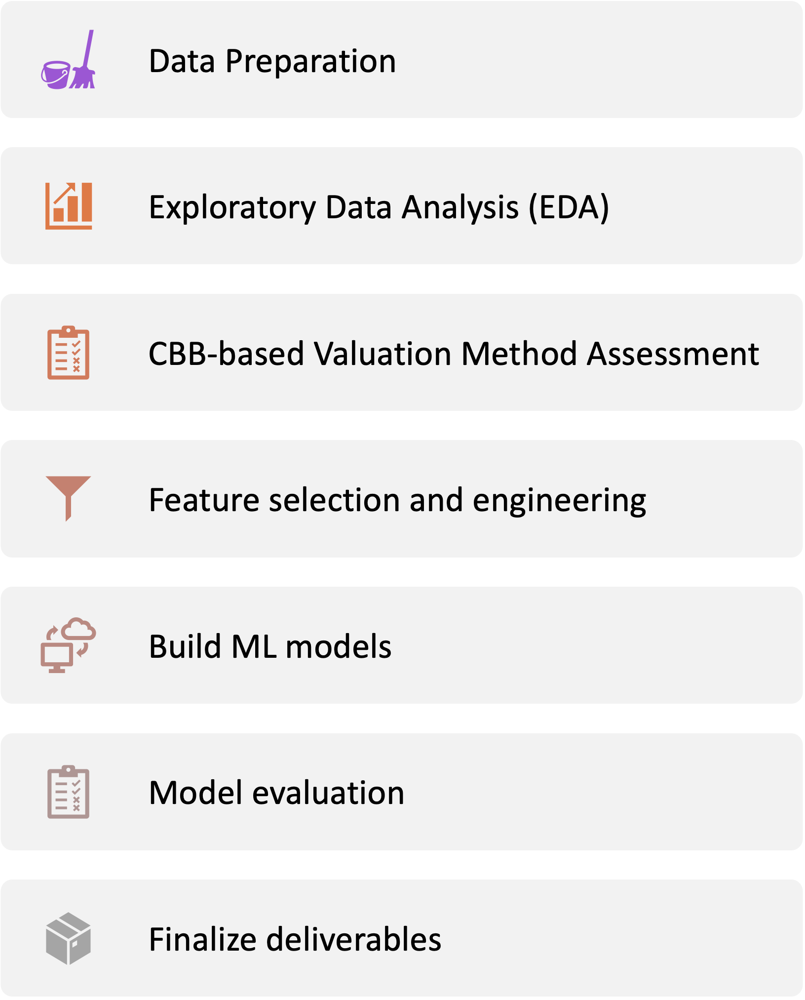

::: {align="center"}
### Team Members:

-   Mengjun Chen
-   Dhruvi Nishar
-   HanChen Wang
-   Tony Zoght

### **Partner:**

Autozen Technology

### Mentor:

Dr. Gittu George

### Course:

DSCI 591 Capstone Project

Summer 2023

The University of British Columbia

### Word count:

1199
:::

\newpage

## Executive Summary

Autozen is a marketplace that connects private car sellers and dealerships in the used car market. As with any used car marketplace, one of the biggest challenges is accurately valuing the cars. Autozen uses the Canadian Black Book (CBB) to estimate the market value of used cars but has struggled with pricing inconsistencies. This can result in overpricing, which can deter potential buyers, or underpricing, which can cause the seller to lose out on potential profit. To address this issue, Autozen proposes the Autozen Valuation Guru project to leverage Data Science and Machine Learning methods to improve used car valuation. This project aims to help Autozen understand how used car features affect prices, assess the current CBB-based valuation method, and create a new valuation pipeline. By delivering a more accurate and reliable valuation, this project enables buyers and sellers to make informed decisions with greater confidence and positions Autozen as a leader in the used car market.

## Introduction

In recent years, the used car market has grown rapidly due to increasing demand from consumers seeking affordable and reliable vehicles [@taylor2021measuring]. However, valuing used cars accurately remains a challenge, as a wide range of factors can influence the final price. Private sellers and dealerships often struggle to agree on fair prices, leading to pricing inconsistencies and a lack of transparency in the used car market. Autozen, a company that operates a used car marketplace, has also struggled with this challenge [@autozen_2023]. In the past two years, 9.4% of Autozen's car auctions were lower than the initial CBB-based valuation range [@Canadian_Black_Book_2023] (Figure 1). Therefore, improving used car valuation accuracy and precision is an urgent demand for Autozen.

To address this need, Autozen has proposed the Autozen Valuation Guru project, a data science (DS) and machine learning (ML)-based solution aiming to improve the accuracy and reliability of its used car valuation. This project seeks to leverage DS techniques to better comprehend how used car features impact prices, assess Autozen's current CBB-based valuation method, and create a new valuation pipeline.

As such, this project has the potential to provide a better solution that helps buyers and sellers make informed decisions with greater confidence and places Autozen as a leader in the used car market.

{width="402"}

\newpage

## Project Description

### Objectives

This project will use DS and ML techniques to improve Autozen's used car valuation. The project primarily seeks to:

1.  Examine how used car features affect auction prices.
2.  Assess how well the CBB-based valuation method predicts the auctioned price.
3.  Develop a predictive model for the auctioned price using only car inspection data without relying on CBB.

### Stakeholders

The project has the following stakeholders:

| Stakeholders      | Interests                                                   | Impact on design                                         |
|-------------------|-------------------------------------------------------------|----------------------------------------------------------|
| Autozen (primary) | Increase competitiveness in the market and user engagement. | Requires an accurate and precise prediction.             |
| Sellers           | Maximizing the sale price.                                  | Requires an accurate upper bound of prediction interval. |
| Buyers            | Getting the best deal on a car.                             | Requires an accurate lower bound of prediction interval. |

### Data Overview

The raw data originates from a read-only copy of the Autozen website, where sellers list and auction their pre-owned vehicles. The source data consists of three relational tables with a mixture of structured columns and JSON objects; we will process and extract the relevant data from these tables, which are vehicle inventory, vehicle inspections, and auction tables.

The tables contain information regarding car listings, inspections, and auctions, respectively. There are a total of 218 characteristics that aid in predicting its used-market value (Figure 2, Appendix A). These characteristics are divided into 8 categories:

-   General information: make, model, year, mileage, color, and location, etc.
-   Outside: rust status, scratches etc.
-   Tires: tread depth, condition of rims, etc.
-   Under-vehicle: exhaust state, differential etc.
-   Under the hood: including the condition of the drive belt, battery, engine oil, etc.
-   Lighting: working conditions of headlights and taillights, etc.
-   Interior: seats, dashboard, odors, etc.
-   Test drive evaluations: handling, braking system, external noise, etc.

The input variables are the various features from car listing and inspections and the target to predict is the final auctioned price (whether accepted or not by the seller).

{width="668"}

\newpage

## Data Science Techniques

### Workflow Overview

We have included a simplified workflow for this project (Figure 3) and will describe each step with more details below.

{width="327"}

### Data Preparation

We will focus on data quality and standardization to ensure reliable analysis. We will preprocess the data by cleaning, imputing, removing null values, normalizing, scaling numerical values, and converting data (including the JSON objects) to CSV formats. This step establishes the groundwork for consistent and reliable analysis throughout the project.

### Exploratory Data Analysis (EDA)

We will perform EDA to identify trends and patterns in the data. This will help us understand the relationship between various features and the auctioned price of used cars.

### CBB-based Valuation Method Assessment

We will evaluate Autozen's current CBB-based valuation method using the evaluation metrics, as described in Evaluation Approaches below. The results will serve as the baseline for comparing the accuracy and precision of our proposed predictive models.

### Feature Selection and Engineering

We will select important features for training by analyzing the correlation between each feature and the auctioned price and using a number of techniques to reduce the dimensionality of the features. Such methods include **Group Lasso** which works well when there is a group of related features. Additionally, we will examine other PCA-based techniques like Multiple Correspondence Analysis (**MCA**) and Factor of Mixed Data (**FAMD**) which are both useful when there is a mixture of continuous, categorical, and ordinal features. We will also consider new features by combining and transforming existing ones to improve the prediction model's accuracy.

### Machine Learning Models

We will start with simple data science techniques to obtain a baseline for our prediction model, such as **linear regression**, Decision Trees and Ensemble Methods **(Random Forests, Gradient Boosting)**. We will evaluate the model's accuracy and compare it to the present Autozen (which is based on CBB) valuation method's accuracy in anticipating the auctioned price. As we improve the model, we will utilize more advanced techniques such as **neural networks**, and **deep learning**.

### Model Evaluation

Our goal is to improve the accuracy and precision of predicting auction prices. We will use Mean Absolute Percentage Error (MAPE) and adjusted R-squared to assess model accuracy. Autozen aims to improve the prediction interval accuracy compared to the current CBB-based model.

### Difficulties and Challenges

The used car market is complex, and auction prices can fluctuate. Obtaining precise and dependable data can be difficult, and incomplete information can impact model accuracy. We will deal with these problems using techniques like data cleaning and imputation to ensure data accuracy and completeness. We must manage the partners' expectations as it's their first experience with Data Science and they have high expectations due to ChatGPT and LLMs hype.

\newpage

## Deliverables

1.  A reproducible **Jupyter Notebook** containing the code and documentation.

2.  A **Tableau dashboard** displaying essential features extracted from the EDA.

3.  **Python scripts** for implementing our ML models with a Pipeline.

4.  **Docker** for the deployment environment.

## Project Timeline

**Milestone 1 (Thursday, May 11th)**: Identify baseline model and evaluation metrics.

**Milestone 2 (Thursday, May 18th)**: Assess initial models.

**Milestone 3 (Thursday, May 25th**): Evaluate the final model.

**Milestone 4 (Thursday, June 1st**): Assemble all deliverable.

**Milestone 5 (Thursday, June 8th)**: Submit the final deliverable.

## References
